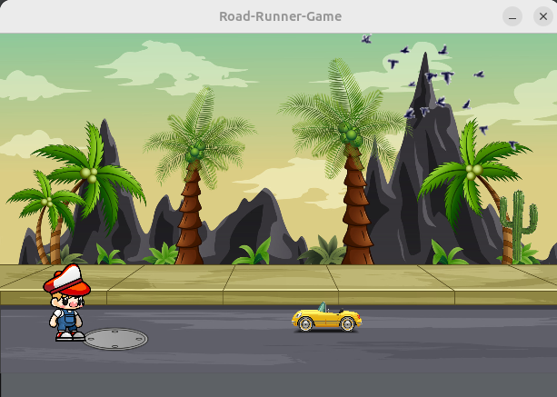

# <h1 align="center">🏁 Road Runner Game

<p align="center">

<br>
Screenshot - Road Runner Game
</p>
<br>

## 🎮 Project Overview
The **Road Runner Game** is a simple yet engaging game where players must navigate a runner along a road while avoiding obstacles. The goal is to survive as long as possible without crashing into obstacles. The game is built using **Java** and **JavaFX Scene Builder**, featuring smooth transitions and animations for an immersive gameplay experience.

<br>
<hr>


## ✨ Features
- 🚗 **Runner Movement**: Control the character to avoid obstacles.
- 🏆 **Winning Condition**: Keep running and dodging obstacles to survive.
- 🎨 **Smooth Animations**: Implemented using JavaFX transitions and animation effects.
- 🎵 **Sound Effects**: (Optional) Add background music and sound effects for a better experience.
- ⏳ **Difficulty Scaling**: The game gets harder as time progresses.

<br>
<hr>

## 🛠️ Technologies Used

The Road-Runner was developed basically with Java language.
- **Java** (Core Game Logic)
- **JavaFX** (User Interface and Graphics)
- **Scene Builder** (UI Design)
- **JavaFX Transitions & Animations** (Smooth character movements and effects)


![java-url]  &nbsp;&nbsp;&nbsp;&nbsp;&nbsp;&nbsp;&nbsp;&nbsp;&nbsp;&nbsp;&nbsp;&nbsp;&nbsp;&nbsp;&nbsp;&nbsp;&nbsp;&nbsp;&nbsp;&nbsp; ![javafx][javafx-url]
<br><br>


<br>
<hr>

## 🚀 Installation & How to Play
1. **Clone the repository**:
   ```sh
   git clone https://github.com/Isuranga-Seram/Road-Runner-Game.git
   cd Road-Runner-Game


2. Open the project in an IDE (e.g., IntelliJ IDEA, Eclipse, or NetBeans) with JavaFX support.

3. Run the main Java file to start the game.

4. Controls:

   * Use arrow keys (←, →) to move the runner.
   * Avoid obstacles by pressing '_ space bar' and keep running to win!

<br>
<hr>

## 🔮 Future Enhancements

- Add multiple levels with increasing difficulty.

- Introduce power-ups and speed boosts.

- Implement a scoring system and leaderboard.

- Add customizable characters and themes.

<br>
<hr>

### 📳 Version
**0.0.1**

<br>
<hr>


## Contact ☎

Isuranga Seram [email] - **_isurangaseram@gmail.com_**

LinkedIn: [linkedin.com/in/isuranga-seram](linkedin.com/in/isuranga-seram)

<br>
<hr>

## 📜 License

Copyright &copy; 2025 Road-Runner-Game. All Rights Reserved.  
This project is licensed under the [MIT License](LICENSE.txt)

Enjoy the game and happy running! 🏃‍♂️💨

<br>


[road-runner-screenshot]: img/road-runner.png
[java-url]: https://upload.wikimedia.org/wikipedia/en/thumb/3/30/Java_programming_language_logo.svg/121px-Java_programming_language_logo.svg.png
[javafx-url]: https://upload.wikimedia.org/wikipedia/en/thumb/c/cc/JavaFX_Logo.png/220px-JavaFX_Logo.png